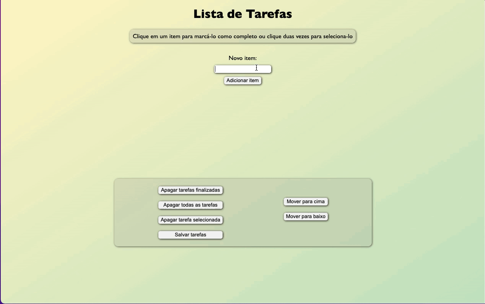

# Todo List - Trybe

This is a solution to the ToDo List project from the fundamentals module of Trybe web development course.

## Table of contents

- [Overview](#overview)
  - [The project](#the-project)
  - [Screenshot](#screenshot)
  - [Links](#links)
- [My process](#my-process)
  - [Built with](#built-with)
- [Author](#author)

## Overview

### The project

Create a todo list web page with the specifications below:

Users should be able to
- Add new items to the list;
- Select an item;
- Mark an item as done;
- Save selected items so they're redered when the page refreshes;
- Delete selected items;
- Delete items marked as done;
- Delete all items;
- Move an item up and down the list.

### Screenshot

### Links

- Solution URL: [Github](https://github.com/RenatoDourad0/Project_ToDo_List_Trybe)
- live site: [Link](https://renatodourad0.github.io/Project_ToDo_List_Trybe/)

## My process

### Built with

- Semantic HTML5
- CSS
- Vanilla JS: event handling / DOM manipulation

## Author
  
  Renato Campos
- [GitHub](https://github.com/RenatoDourad0)
- [Linkedin](www.linkedin.com/in/renato-dourado-b1b301112)

Contributors besides Renato were responsible for evaluation files that have been removed after approval.
